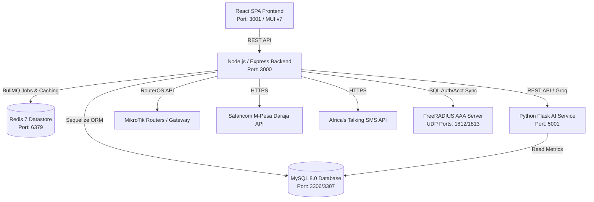

# 🌐 ISP Billing & Management System

[](https://opensource.org/licenses/ISC)
[](https://nodejs.org/)
[](https://reactjs.org/)
[](https://python.org/)
[](https://www.docker.com/)

A modern, production-grade enterprise **Internet Service Provider (ISP) Billing, Network Provisioning, and Management Platform** tailored for ISPs and Wireless Internet Service Providers (WISPs), with specialized integration for the **Kenyan market (Safaricom M-Pesa & Africa's Talking SMS)**.

📺 **[Watch YouTube Demo / Walkthrough](https://youtu.be/frAzeNYZ4ZE)**

---

## 🚀 System Architecture Overview

The system uses a containerized microservices architecture with isolated responsibilities:



---

## ✨ Key Features & Capability Matrix

### 1. 💳 M-Pesa Daraja Payment Integration
- **STK Push (C2B / LIPA NA M-PESA)**: Instant mobile payment prompt sent directly to customer phones.
- **Asynchronous Callback Processing**: Automatic payment validation, receipt generation, and immediate account re-activation upon successful payment.
- **Automated Payment Reconciliation**: Cron-driven transaction status polling for failed/pending payments.

### 2. 🔌 MikroTik Router Provisioning & Network Automation
- **RouterOS API Client**: Direct connection to MikroTik routers for PPPoE and Hotspot subscriber management.
- **Auto Suspend / Unsuspend**: Automatic bandwidth queue adjustment and IP binding suspension when subscriptions expire or payments complete.
- **Encrypted Credentials**: AES-256 storage for high-security router passwords with fallback mock router mode (`MOCK_MIKROTIK=true`) for local development without physical hardware.
- **Resilient Circuit Breaker**: BullMQ job queues with automatic retry strategies, exponential backoff, and circuit breaker patterns to prevent network overload.

### 3. 📡 FreeRADIUS & Hotspot Voucher System
- **AAA Server Integration**: Built-in FreeRADIUS 3 container synchronized with MySQL backend for centralized network authentication and accounting.
- **Digital Hotspot Vouchers**: Instant generation of single-use or time-bound voucher codes.
- **Brute-Force Throttling**: Built-in rate limiting and security counters against voucher scanning attacks.

### 4. 🤖 AI Microservice & Predictive Intelligence
- **Powered by Groq LLM (Llama 3)** and statistical machine learning models:
  - 📉 **Customer Churn Risk Prediction**: Identifies high-risk subscribers based on usage drop-offs and payment behavior.
  - 📊 **Bandwidth Usage Forecasting**: Predicts network peak load and subscriber bandwidth trends.
  - 🚨 **Anomaly Detection**: Flags abnormal payment patterns and sudden bandwidth spikes.
  - 💬 **AI Customer Support Assistant**: Interactive AI assistant to handle subscriber queries.
  - 📈 **Executive Analytics Dashboard**: AI-driven insights on revenue growth, customer health, and operational performance.

### 5. 📲 Smart Dunning & SMS Automation
- **Africa's Talking Integration**: Automated SMS notifications for payment reminders, subscription expiry, and voucher delivery.
- **Smart Dunning Engine**: Configurable grace periods, multi-stage reminder windows, and automatic service cutoffs.
- **Comprehensive SMS Audit Logs**: Complete tracking of sent, pending, and failed SMS messages.

### 6. 📄 Subscription, Plan & Invoicing Engine
- **Data Plan Management**: Flexible creation of plans (Speed limits, burst rates, data caps, duration).
- **Invoice & Receipt Generation**: Dynamic PDF generation using `PDFKit` with download/email capabilities.
- **Audit Logging**: Granular system audit trails tracking administrative actions and system events.

### 7. 🎨 Modern React Admin & Customer Portal
- **Material-UI (MUI v7)**: Sleek, responsive layout with dark/light mode customization.
- **Interactive Dashboards**: Real-time charts powered by `Recharts` for revenue, data usage, queue health, active sessions, and network device monitoring.

---

## 🛠️ Technology Stack

| Layer | Technologies & Libraries |
| :--- | :--- |
| **Frontend** | React 18, React Router v7, Material-UI (MUI v7), Recharts, Axios, Emotion |
| **Backend API** | Node.js, Express.js, Sequelize ORM, MySQL 8.0, Winston Logging, Swagger API Docs |
| **Async Queues** | BullMQ, Redis 7, Node-Cron background scheduling |
| **AI Microservice** | Python 3.11, Flask, Groq API (Llama-3-8b-8192), NumPy, SciPy, MySQL Connector |
| **AAA / Network** | FreeRADIUS 3, RouterOS API (`routeros-client`), Crypto AES-256 |
| **Integrations** | Safaricom M-Pesa Daraja API, Africa's Talking SMS API, PDFKit |
| **DevOps & Infrastructure** | Docker, Docker Compose, MySQL 8.0, Redis Alpine |

---

## 🚀 Getting Started

### Method 1: Using Docker Compose (Recommended)

The easiest way to run the entire system (Frontend, Backend, AI Service, MySQL, Redis, FreeRADIUS) is via Docker Compose.

1. **Clone the repository:**
   ```bash
   git clone https://github.com/your-username/ISP-BILLING-SYSTEM.git
   cd ISP-BILLING-SYSTEM
   ```

2. **Configure Environment Variables:**
   Copy the example `.env` file at the root:
   ```bash
   cp .env.example .env
   ```
   *Edit `.env` to include your M-Pesa keys, Africa's Talking API key, Groq API key, and set `MOCK_MIKROTIK=true` for testing without physical routers.*

3. **Build & Start Containers:**
   ```bash
   docker-compose up --build -d
   ```

4. **Verify Service Endpoints:**
   - 🌐 **Frontend UI**: [http://localhost:3001](http://localhost:3001)
   - ⚡ **Backend API**: [http://localhost:3000](http://localhost:3000)
   - 🤖 **AI Microservice**: [http://localhost:5001](http://localhost:5001)
   - 🗄️ **MySQL Database**: `localhost:3307` (Credentials in `.env`)
   - 🔑 **FreeRADIUS Ports**: UDP `1812` (Auth) & UDP `1813` (Accounting)

---

### Method 2: Manual Local Development Setup

#### Prerequisites
- Node.js (v18 or higher) & `npm`
- Python 3.11+ & `pip`
- MySQL (v8.0+)
- Redis Server (v7+)

#### 1. Backend Setup (`isp-billing-system-BACKEND`)
```bash
cd isp-billing-system-BACKEND
npm install

# Setup Database (MySQL must be running)
# Update database credentials in src/config/config.json or .env

# Run database migrations & seed initial data
npm run migrate
npm run seed

# Start backend dev server (Port 3000)
npm run dev
```

#### 2. AI Service Setup (`ai-service`)
```bash
cd ../ai-service
python -m venv venv
# On Windows: venv\Scripts\activate  |  On Linux/Mac: source venv/bin/activate
pip install -r requirements.txt

# Start Flask AI service (Port 5001)
python app.py
```

#### 3. Frontend Setup (`isp-billing-frontend`)
```bash
cd ../isp-billing-frontend
npm install

# Start React dev server (Port 3001)
npm start
```

---

## 📁 Repository Directory Structure

```
ISP-BILLING-SYSTEM/
├── docker-compose.yml              # Multi-container orchestrator configuration
├── docker/                         # Dockerfiles and configs (FreeRADIUS, etc.)
│   └── freeradius/                 # FreeRADIUS Docker setup
├── isp-billing-system-BACKEND/     # Node.js / Express REST API backend
│   ├── src/
│   │   ├── controllers/            # Request handlers (Auth, Payments, Router, Subscriptions, Vouchers)
│   │   ├── services/               # Business logic (M-Pesa, MikroTik, Dunning, RADIUS, PDF)
│   │   ├── models/                 # Sequelize database schemas & models
│   │   ├── jobs/                   # BullMQ async workers & background queue handlers
│   │   ├── routes/                 # Express API routing modules
│   │   ├── middleware/             # Auth, RBAC, Rate-limiting & Validation middleware
│   │   └── server.js               # Express application entry point
│   ├── scripts/                    # Database seeding & utility scripts
│   └── package.json
├── ai-service/                     # Python Flask AI & ML Microservice
│   ├── routes/                     # AI API endpoints (Churn, Anomaly, Forecast, Chat)
│   ├── services/                   # Groq LLM integration & ML analytical models
│   ├── app.py                      # Flask service entry point
│   └── requirements.txt
├── isp-billing-frontend/           # React SPA frontend application
│   ├── src/
│   │   ├── pages/                  # Top-level view components (Dashboard, Payments, Vouchers, etc.)
│   │   ├── components/             # Reusable UI components & layouts
│   │   ├── services/               # API client services & Axios interceptors
│   │   └── theme.js                # MUI custom theme configuration
│   └── package.json
└── isp_seed.sql                    # Production database seed script
```

---

## 🔒 Environment Variables Reference

Key configuration settings found in `.env.example`:

| Variable | Description | Default / Example |
| :--- | :--- | :--- |
| `MPESA_CONSUMER_KEY` | Safaricom Daraja Consumer Key | `your_key` |
| `MPESA_CONSUMER_SECRET` | Safaricom Daraja Consumer Secret | `your_secret` |
| `MPESA_PASSKEY` | Safaricom Daraja Passkey for STK Push | `your_passkey` |
| `MPESA_ENV` | Environment (`sandbox` or `production`) | `sandbox` |
| `GROQ_API_KEY` | Groq API Key for AI Service | `gsk_...` |
| `LLM_MODEL` | AI Model ID | `llama3-8b-8192` |
| `REDIS_HOST` | Redis Server Host | `redis` / `localhost` |
| `MOCK_MIKROTIK` | Enable mock router mode for testing | `true` |
| `SMS_PROVIDER` | SMS Provider | `mock` / `africastalking` |
| `AT_API_KEY` | Africa's Talking API Key | `your_at_key` |
| `RADIUS_SHARED_SECRET` | Secret key for FreeRADIUS client authentication | `min_12_chars_secret` |

---

## 🤝 Contributing

Contributions, issues, and feature requests are welcome!

1. Fork the repository.
2. Create your feature branch (`git checkout -b feature/AmazingFeature`).
3. Commit your changes (`git commit -m 'Add some AmazingFeature'`).
4. Push to the branch (`git push origin feature/AmazingFeature`).
5. Open a Pull Request.

---

## 📄 License

This project is licensed under the **ISC License**.

